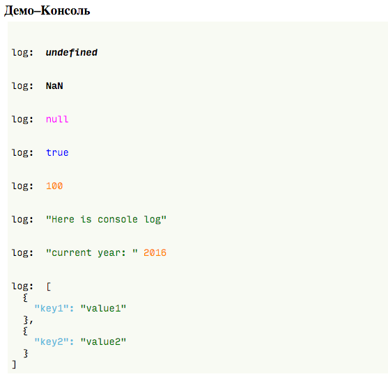

[](https://travis-ci.org/htmlacademy/console-stub)

# Псевдо-Консоль
Вывод лога Консоли в DOM-дерево.

## Подключение

```html
<div class="console-container"></div>

<style> @import url('//htmlacademy.github.io/console-stub/lib/index.css'); </style>
<script src="//htmlacademy.github.io/console-stub/lib/index.js"></script>

<script>
 var jsConsole = jsConsoleInit(document.querySelector('.console-container'));
 console.log = jsConsole.log;
</script>
```

## Подписка на лог данных
Метод `onlog` у экземпляра `jsConsole` позволяет подписаться на логирование данных.
Например, если нужно сохранять логированные данные в кеше:

```js
var logCache = [];

jsConsole.onlog = function(logData) {
  logCache.push(logData); // logData — массив
};
```
Внимание: `logData` — **массив** данных, переданных в метод `log`, тк. метод `log` может принимать
произвольное количество данных для логирования.

## Пример
Для запуска примера наберите в терминале `npm run examples` и откройте в браузере страницу <http://localhost:8080/examples>.

### Код
```js
console.log(undefined);

console.log(NaN);

console.log(null);

console.log(true);

console.log(100);

console.log('Here is console log');

console.log("current year: ", (new Date()).getFullYear());

console.log([
  {key1: 'value1'},
  {key2: 'value2'}
]);
```

### Вывод лога

